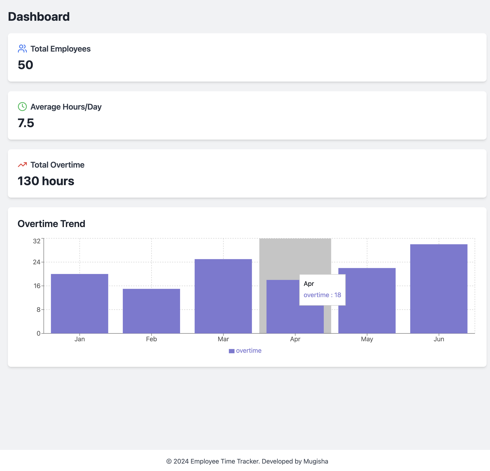

# Employee Time Management System



This project demostrates a case of an employee time management system that uses NFC cards for time logging. It consists of a React frontend, a Node.js backend, and a Python script for NFC card reading.

As it is a personal project, it's not complete and should extensively be revised in case it's intended to be used in real production.

## Project Structure

```
employee-time-management/
├── frontend/
│   ├── public/
│   │   └── index.html
│   ├── src/
│   │   ├── components/
│   │   │   ├── Dashboard.js
│   │   │   ├── TimeLog.js
│   │   │   ├── EmployeeList.js
│   │   │   └── OvertimeReport.js
│   │   ├── App.js
│   │   └── index.js
│   ├── package.json
│   └── tailwind.config.js
├── backend/
│   ├── src/
│   │   ├── controllers/
│   │   │   ├── employeeController.js
│   │   │   └── timeLogController.js
│   │   ├── models/
│   │   │   ├── Employee.js
│   │   │   └── TimeLog.js
│   │   ├── routes/
│   │   │   ├── employeeRoutes.js
│   │   │   └── timeLogRoutes.js
│   │   ├── middleware/
│   │   │   └── authMiddleware.js
│   │   ├── utils/
│   │   │   └── overtimeCalculator.js
│   │   └── app.js
│   ├── package.json
│   └── .env
├── nfc-reader/
│   └── nfc_reader.py
└── README.md
```

## Prerequisites

- Node.js (v14 or later)
- Python (v3.7 or later)
- MongoDB
- NFC card reader (compatible with nfcpy library)

## Setup Instructions

### Backend Setup

1. Navigate to the backend directory:
   ```
   cd backend
   ```

2. Install dependencies:
   ```
   npm install
   ```

3. Create a `.env` file in the backend directory with the following content:
   ```
   PORT=5000
   MONGODB_URI=mongodb://localhost:27017/employee_time_management
   JWT_SECRET=your_jwt_secret_here
   ```
   Replace `your_jwt_secret_here` with a strong, random string.

4. Start the backend server:
   ```
   npm start
   ```

### Frontend Setup

1. Navigate to the frontend directory:
   ```
   cd frontend
   ```

2. Install dependencies:
   ```
   npm install
   ```

3. Start the frontend development server:
   ```
   npm start
   ```

### NFC Reader Setup

1. Navigate to the nfc-reader directory:
   ```
   cd nfc-reader
   ```

2. Install the required Python libraries:
   ```
   pip install nfcpy requests
   ```

3. Connect your NFC card reader to your computer.

4. Run the NFC reader script:
   ```
   python nfc_reader.py
   ```

## Running the Application

1. Ensure MongoDB is running on your system.
2. Start the backend server (from the backend directory):
   ```
   npm start
   ```
3. Start the frontend development server (from the frontend directory):
   ```
   npm start
   ```
4. Run the NFC reader script (from the nfc-reader directory):
   ```
   python nfc_reader.py
   ```
5. Open a web browser and navigate to `http://localhost:3000` to access the application.

## Using the Application

1. Use the EmployeeList component to add new employees and their NFC card IDs.
2. Employees can use their NFC cards with the NFC reader to log their time.
3. Use the Dashboard to view overall statistics.
4. Use the OvertimeReport component to view detailed overtime reports for each employee.

## Troubleshooting

- If you encounter issues with the NFC reader, ensure that it's properly connected and recognized by your system.
- For backend connection issues, check that MongoDB is running and that the connection string in the `.env` file is correct.
- For frontend issues, check the browser console for any error messages.

## Security Considerations

- This application doesn't include user authentication. In a production environment, you should implement proper authentication and authorization.
- Ensure to use HTTPS in production to encrypt data in transit.
- Regularly update all dependencies to patch any security vulnerabilities.

## Future Enhancements

- Implement user authentication and role-based access control.
- Add more detailed reporting features.
- Implement real-time updates using WebSockets.
- Create a mobile app version for easier time logging.